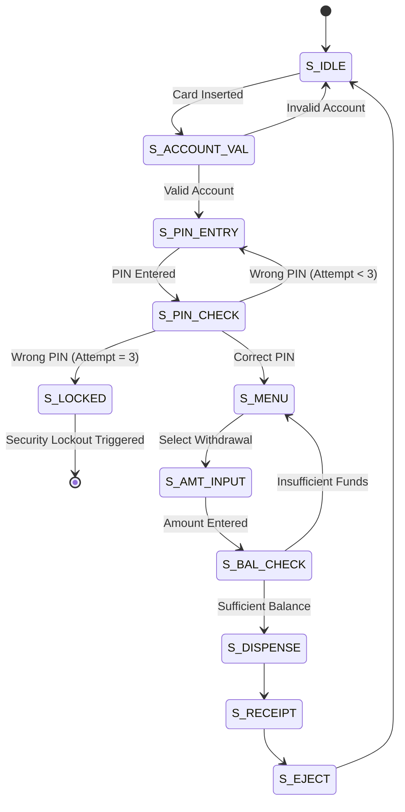

# ATM Transaction Workflow - FSM Project

A comprehensive hardware-level simulation of an Automated Teller Machine (ATM) using a 12-state Finite State Machine (FSM). This project bridges the gap between low-level Verilog logic and high-level interactive visualization.

## 🚀 Features
- *Multi-State Security*: Implements a complex 12-state FSM for robust transaction handling.
- *Authentication*: Validates 16-bit account numbers and 4-bit PINs.
- *Security Lockout*: Real-time tracking of failed attempts with a permanent S_LOCKED state after 3 failures.
- *Hardware-Level Constraints*: Validates balance registers and withdrawal increments (multiples of 10).
- *Hybrid Simulation*: Verilog logic verified via GTKWave testbenches alongside an interactive HTML/CSS/JS functional simulator.

